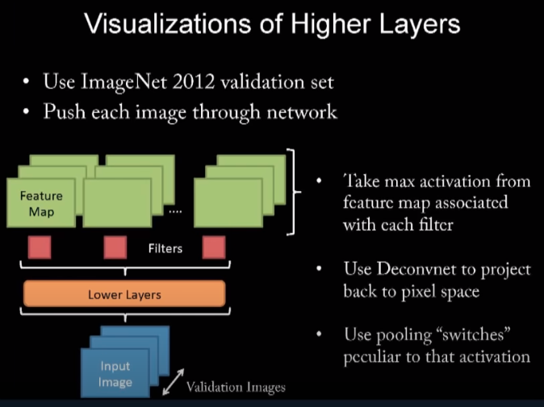
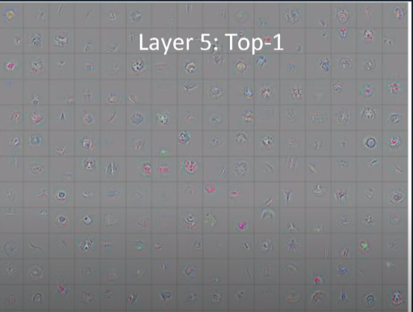
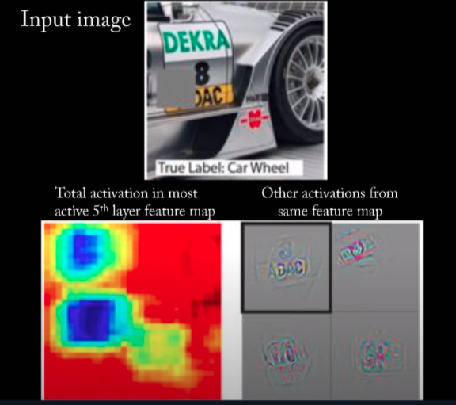
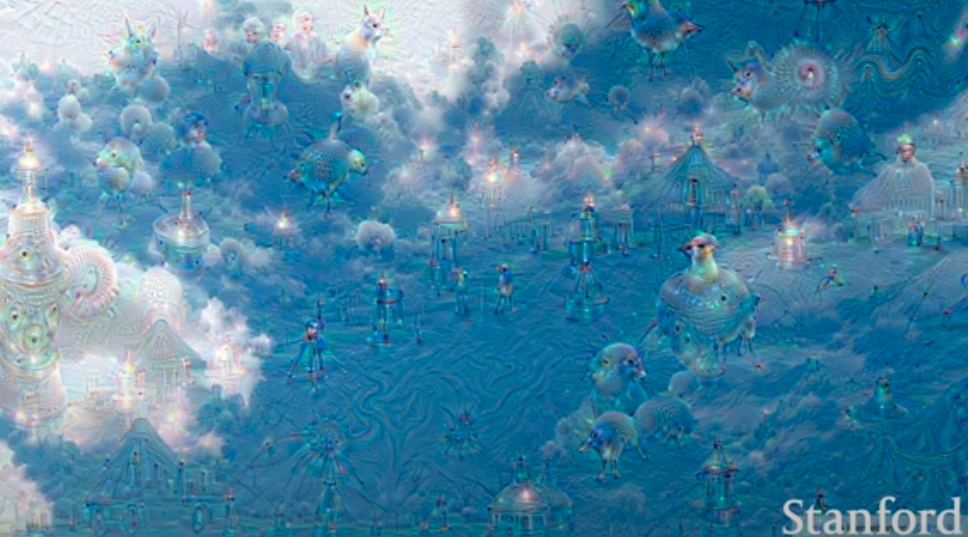
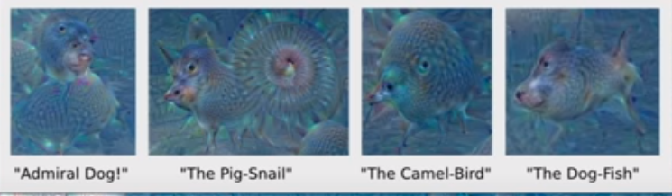
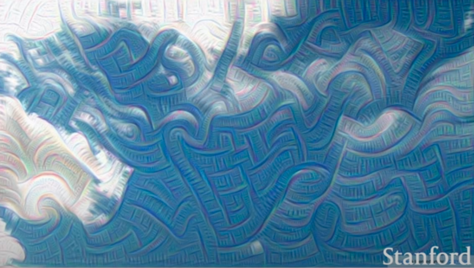

[Lecture 12: Visualizing and Understanding](https://www.youtube.com/watch?v=6wcs6szJWMY)

"To visualize, we select a single feature map to look at..and we take the strongest activation in that map and that input image.
 This is used as input to the Deconv Layer (which uses the same switches for pool/unpool and same filters for conv/deconv) to construct the output in the pixel space. In fact we want to take max activation over all input images. And in fact we want to visualize all feature maps in all layers. So we take max activation for each feature map over all images."

 
 
 

 

"from unpooling we implicitly get some local rotation invariance"

"even though there is no class `text` the model learned to associate text with the car class"

Other ways to visualize CNN features: 

- Gradient Ascent! Note that you can't take too seriously the colours you see in [these visualizations](#FigA) as the input is scaled in 0-255 .. except if you do constrainted (projected) gradient ascent or rescale the image at the end .. 
  
- DeepDream

    
    
    

- FeatureInversion

### Texture Synthesis:

- Nearest Neighbor (traditional approach)

    if we have a complext texture then this method doesnt work so well 

- NN approach: Gram matrix
    
    each convolutional layer gives an output of CxHxW
    the outer product of two C-dimensional vectors (e.g. a CxH or a CxW) will output a CxC matrix that **measures co-occurrence**
    
    calculate the CxC matrix for each combination of C-dimensional vectors available in the feature map and then average these CxC matrices to get the Gram matrix!
    
    This matrix **throws away all spatial information** (because we average all pairs of features in the image) and **keeps just texture** info about the image!

    This matrix can be efficiently calculated.
    
    _(note: we could instead use the true covariance matrix but that is more expensive to compute)_
    

### Neural Style Transfer 

    Neural Style Transfer = Texture Synthesis + Feature Reconstruction

Minimize the feature reconstruction loss of the content image and the gram matrix reconstruction loss of the style image. 

Requires a lot of forward/backward passes on VGG .. there is another approach to do train a feed forward nn .. which is faster ..