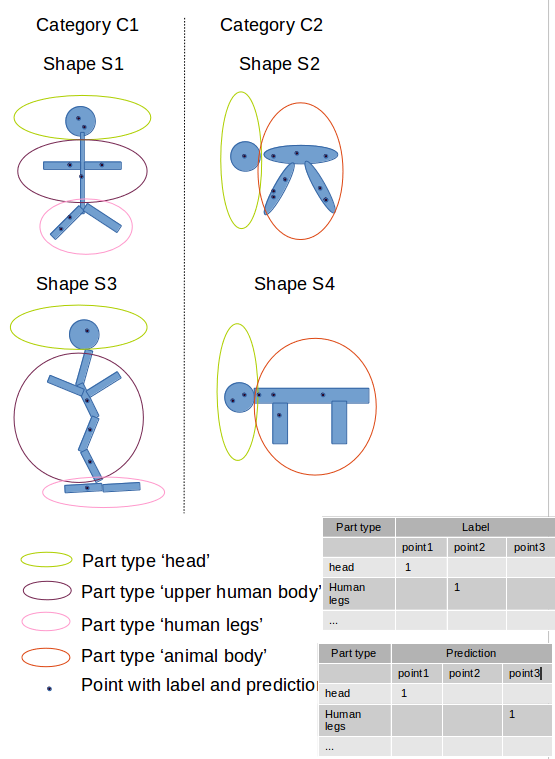

## Quantitative Evaluation

#### mIoU on points for 3D object part segmentation

1. mIoU for shape S of category C:

    1. for each part type in category C compute IoU between groundtruth and prediction (if union of groundtruth and prediction points is empty then consider part IoU as 1)

    2. average IoUs for all part types in category C to get mIoU for that shape

2. mIoU for the category is average of mIoUs for all shapes in that category



for example:
```
IoU for shape S1 and part type 'head':
    intersection = point1, union = point1
for part type 'human legs': 
    intersection = [], union = point2, point3
``` 

#### mIoU points vs mesh:


## Qualitative Evaluation

#### [Occlusion Experiments](https://youtu.be/6wcs6szJWMY?t=1774) for Image Classification
The idea is "if masking a position reduces a lot the correctness of the model then that position is very informative for that class"!

Note that this evaluation is only for our understanding of the model and not for giving feedback to the network to improve its learning.
