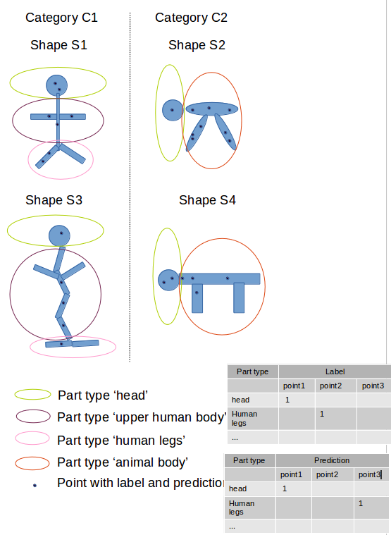

#### evaluation metric mIoU on points for 3D object part segmentation

a. mIoU for shape S of category C:
    1. for each part type in category C compute IoU between groundtruth and prediction (if union of groundtruth and prediction points is empty then consider part IoU as 1)
    2. average IoUs for all part types in category C to get mIoU for that shape
b. mIoU for the category is average of mIoUs for all shapes in that category

for example IoU for shape S1 and part type 'head' : intersection = point1, union = point1
for part type 'human legs': intersection = [] union = point2, point3
