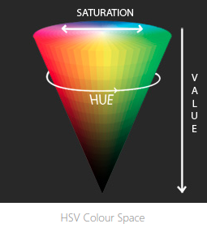

Representation of 3D objects:
---

#### Volumetric Representation
Basically it's the representation of objects in 3D.

#### Multi View images 
Basically it's multiple 2D representations

#### Depth map
Is an image or image channel that contains information relating to the distance of the surfaces of scene objects from a viewpoint.

---

Examples of volumetric representation: 
---

#### Octree

Is a tree data structure in which each internal node has exactly eight children


So ... in places where our 3D object has boundaries and we want to show more details .. a node in one level of the octree is split (adding a new level in the octree)

Each node in an octree subdivides the space it represents into eight octants.

A node stores an explicit three-dimensional point, which is the "center" of the subdivision for that node;

We use depth-first search and only required surfaces are viewed..

#### Occupancy Grid
It is a discretized fine grain grid map (in 2D or 3D)

Each square (or cube) of the grid must have a binary value regarding the objects occupying it .. i.e. it has trees or it doesnt..

It represents only static environment (e.g. a car in the scene that is moving wont be represented)

#### Probabilistic occupancy grid
Instead of cell storing binary values it stores a probability corresponding to the probability that the square (or cube) is occupied

We can update these probabilities periodically using the prior knowledge each time ..(bayesian update).

---

#### Octant 
In solid geometry i.e. in geometry of 3-d euclidean space, it is similar to quadrant for 2-dim and ray for 1-dim, where quadrant splits each of the two axes in half..thus it creates four boxes, and ray splits a line into two..

#### Affine transformation
A geometric transformation that preserves lines and parallelism (but not necessarily distances and angles).

An affine transformation is any transformation that combines linear transformations and translations. The origin does not always have to map the origin. [link](https://maelfabien.github.io/computervision/cv_5/#2-affine-transformation)


#### Saliency map
An image that shows each pixel's unique quality
Saliency can be seen as a segmentation problem...i.e. categorizing pixels...

#### LiDAR
LiDAR sensor uses pulses of light to mesure the distance of all points to our object of interest

Common Terms in Computer Vision
---

#### Contour
What happens if we find the edges in this image? That is, we mark all pixels that are next to a very different depth as black, and the rest as white?
With this simple procedure we have something that starts to look like a line drawing. These curves are called the contours, and drawing contours is the foundation of realistic line drawing.
The contour separates visible parts of the surface from hidden parts.

Keywords related: salient lines, silhouette, canny edge, wireframe, crease, contour lines, descriptive-curves-flow-rep
Repos related: shapepfcn

#### HOG (Histogram of oriented gradients)
Counts occurrences of gradient orientation in localized portions of an image.

i.e. for example:
navigate through pixels of your image (you need to define first your pixel size), and calculate the x-grandient and y-gradient i.e. going from pixel value 50 to 100 means gradient (absolute) magnitude 50..use also gradient orientation..and create a histogram..

#### [RGB vs HSV](https://handmap.github.io/hsv-vs-rgb/)

RGB is defined by listing how much red, green and blue is contained in a single value. It uses an additive method where the more of each colour is added, the brighter it becomes.

HSV on the other hand uses three paramters to describe colour: Hue, Saturation, Value

With HSV with we now describe our colour using a much more cement method as we only theoretically need to transform the Hue to capture the ‘red’ like colour.


Common Terms in Deep Learning
---

#### Feature Map (in Convolutional Neural Networks)
it is the output of an input convolved with a filter 
e.g. input shape 100x100x3 and 20 filters of 3x3 and stride 1 gives output 98x98x20 which is the feature map

#### Activation Volume (in Convolutional Neural Networks)
if e.g. input shape is 10 x 10 and filters used in convolution layer are 4 filters of 3x3 then activation volume is the resulting 8x8x4

_**Activation map**_ is each of the 8x8 results.

(Feature Map = Activation Volume!!!)


#### Skip Connections
Connections from early layers to later layers through addition or straight up concatenation.

A popular network using skip connections is the ResNet (Residual Network)  where skip connection is the yellow arrow which just adds the input x to the output of two resulting layers F(x), hence the overall output of the block is F(x)+x. (this type of skip connection is called residual connection)

Intuition: uninterrupted gradient flow from first layer to last layer, to tackle the vanishing gradient problem of deep networks.

Other networks use as skip connection a concatenation from first layer to the output of a later layer.


Common Terms in Machine Learning:
---

#### Odds
```
"the odds in favor of my team winning the game are 5 to 3"
i.e. 5/3
i.e. over 8 games, my team will win the 5
```

- Odds are not probabilities.
- Odds are the ratio of something happening ```i.e. my team winning``` to something not happening ```i.e. my team not winning```.
- Probability is the ratio of something happening ```i.e. my team winning``` to everything that could happen ```i.e. my team winning and losing```

thus in above example probability of my team winning is 5/8

- You can calculate the odds:
    1. directly from the counts i.e. 5 wins / 3 losses or 
    2. directly from the probabilities i.e. probability of winning / probability of losing = 5/8 / 3/8 = 5/3
```
note: 
if my team is bad --> the odds of winning are below 1. 
if my team is good--> the odds of winning are above 1.
```

#### Log Odds


The assymetry makes it difficult to compare the odds for or against my team winning.
**_--> Taking the log of the odds solves this problem by making everything symmetrical!_**

_**Using the log function, the distance from the origin (or 0) is the same for 1 to 6 and 6 to 1 odds.**_

log(odds) = log (5/3) or log (5/8 / 5/3)

i.e. log(p/1-p) which is called **_"logit function"**_ (and is the basis of logistic regression!!)


#### Cosine similarity
In a large dimensional space, all points tend to be far apart by the euclidian measure, thus the angle between vectors is a more effective measure. The cosine distance measures the cosine of the angle between the vectors. 

The cosine of identical vectors is 1 while orthogonal and opposite vectors are 0 and -1 respectively.
 
More similar vectors will result in a larger number. Calculating the cosine distance is done by taking the dot product of the vectors.

#### Softmax function

The softmax function takes a vector of real numbers and forces them into a range of 0 to 1 with the sum of all the numbers equaling 1. One other nice property of softmax is that one of the values is usually much bigger than the others.

