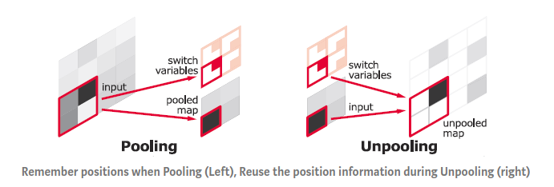
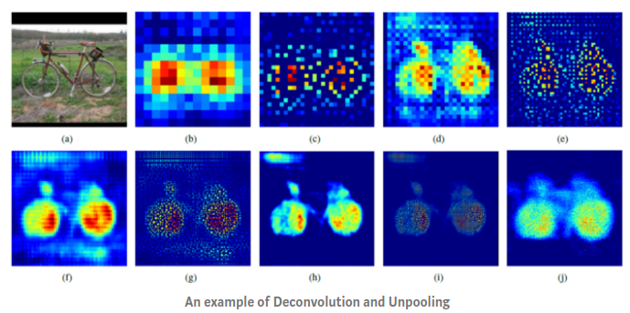

Upsampling refers to any technique that upsamples your image to a higher resolution.

- Resampling and Interpolation

    The easiest for upsampling. You take an input image, rescale it to the desired size and then calculate the pixel values at each point using an interpolation method (e.g.bilinear interpolation)

- Unpooling
    
    Another upsampling method. Usually used in convolutional neural networks to denote reverse max pooling.
   
    From the paper.. "In the convnet, the max pooling operation is non-invertible, however we can obtain an approximate inverse by recording the locations of the maxima within each pooling region in a set of switch variables. In the deconvnet, the unpooling operation uses these switches to place the reconstructions from the layer above into appropriate locations, preserving the structure of the stimulus."
    
    
    To perform unpooling, we need to remember the position of each maximum activation value when doing max pooling, as shown above. Then, the remembered position is used for unpooling as shown above.
    
- Deconvolution (Inverse Convolution / Transposed Convolution / Up Convolution / Fractional Convolution):

    Another way of upsampling usually used with convolutional neural networks. Denotes **a sort of** reverse convolution. 
    
    In contrast to unpooling, using ‘deconvolution’ the upsampling of an image can be learned. (i.e. upsampling method can be trained and optimized)
    
    http://deeplearning.net/software/theano_versions/dev/tutorial/conv_arithmetic.html#no-zero-padding-unit-strides-transposed
    
    _(Referring to this operation as a deconvolution is technically incorrect as a deconvolution is a specific mathematical operation not performed by this layer.)_
    
    Can be called fractional conv because:
    if you do a normal convolution with stride 1/2 you can do an inverse convolution with stride 2 and get back your initial input.
    
    Note that it is always possible to mimic a transposed convolution with a direct convolution. The disadvantage is that it usually involves adding many columns and rows of zeros to the input …


Keras
---

##### keras UpSampling2D:
A layer with no weights that doubles the dimensions of input.

Example:
```python
# example of using the upsampling layer
from numpy import asarray
from keras.models import Sequential
from keras.layers import UpSampling2D
# define input data
X = asarray([[1, 2],
			 [3, 4]])
# show input data for context
print(X)
# reshape input data into one sample a sample with a channel
X = X.reshape((1, 2, 2, 1))
# define model
model = Sequential()
model.add(UpSampling2D(input_shape=(2, 2, 1)))
# summarize the model
model.summary()
# make a prediction with the model
yhat = model.predict(X)
# reshape output to remove channel to make printing easier
yhat = yhat.reshape((4, 4))
# summarize output
print(yhat)
```

prints
``` 
[[1 2]
 [3 4]]
 
_________________________________________________________________
Layer (type)                 Output Shape              Param #
=================================================================
up_sampling2d_1 (UpSampling2 (None, 4, 4, 1)           0
=================================================================
Total params: 0
Trainable params: 0
Non-trainable params: 0
_________________________________________________________________
 
 
[[1. 1. 2. 2.]
 [1. 1. 2. 2.]
 [3. 3. 4. 4.]
 [3. 3. 4. 4.]]
```

You may want to use different factors on each dimension, such as double the width and triple the height. This could be achieved by setting the ‘size‘ argument to (2, 3). The result of applying this operation to a 2×2 image would be a 4×6 output image (e.g. 2×2 and 2×3).

By default, the UpSampling2D layer will use a nearest neighbor algorithm to fill in the new rows and columns. (i.e. ‘interpolation‘ argument set to ‘nearest‘.) Alternatively you can set ‘interpolation‘ argument to ‘bilinear‘.

To be useful (e.g. in a GAN), each UpSampling2D layer must be followed by a Conv2D layer that will learn to interpret the doubled input and be trained to translate it into meaningful detail.

Example:
```python
# example of using upsampling in a simple generator model

# GAN generator model must produce a 10×10 image when take a 100 element vector from the latent space as input.

from keras.models import Sequential
from keras.layers import Dense
from keras.layers import Reshape
from keras.layers import UpSampling2D
from keras.layers import Conv2D
# define model
model = Sequential()
# define input shape, output enough activations for 128 5x5 image
model.add(Dense(128 * 5 * 5, input_dim=100))
# reshape vector of activations into 128 feature maps with 5x5
model.add(Reshape((5, 5, 128)))
# double input from 128 5x5 to 1 10x10 feature map
model.add(UpSampling2D())
# fill in detail in the upsampled feature maps and output a single image
model.add(Conv2D(1, (3,3), padding='same'))
# summarize model
model.summary()
```
this outputs:
``` 
_________________________________________________________________
Layer (type)                 Output Shape              Param #
=================================================================
dense_1 (Dense)              (None, 3200)              323200
_________________________________________________________________
reshape_1 (Reshape)          (None, 5, 5, 128)         0
_________________________________________________________________
up_sampling2d_1 (UpSampling2 (None, 10, 10, 128)       0
_________________________________________________________________
conv2d_1 (Conv2D)            (None, 10, 10, 1)         1153
=================================================================
Total params: 324,353
Trainable params: 324,353
Non-trainable params: 0
_________________________________________________________________
```

##### keras Conv2DTranspose:
A layer for inverse convolution that both upsamples input and learns how to fill in details (in the new pixels) during the model training process (i.e. trains its weights)

This layer requires that you specify the number of filters and the kernel size of each filter. The key to the layer is the stride.

note: With an output stride of (2,2), the 1×1 convolution requires the insertion of additional rows and columns into the input image so that the reads of the operation can be performed. Therefore, if input is
```
[[1,2],
 [3,4]]
```
it will be translated into input as
```python
[[1,0,2,0],
 [0,0,0,0],
 [3,0,4,0],
 [0,0,0,0]]
```
and then output is the same 4x4 since filter has weight 1 and bias 0

Example:
```python
# example of using the transpose convolutional layer
from numpy import asarray
from keras.models import Sequential
from keras.layers import Conv2DTranspose
# define input data
X = asarray([[1, 2],
			 [3, 4]])
# show input data for context
print(X)
# reshape input data into one sample a sample with a channel
X = X.reshape((1, 2, 2, 1))
# define model
model = Sequential()
model.add(Conv2DTranspose(1, (1,1), strides=(2,2), input_shape=(2, 2, 1)))
# summarize the model
model.summary()
# define weights that they do nothing
weights = [asarray([[[[1]]]]), asarray([0])]
# store the weights in the model
model.set_weights(weights)
# make a prediction with the model
yhat = model.predict(X)
# reshape output to remove channel to make printing easier
yhat = yhat.reshape((4, 4))
# summarize output
print(yhat)
```
prints:
```
 [3 4]]
 
_________________________________________________________________
Layer (type)                 Output Shape              Param #
=================================================================
conv2d_transpose_1 (Conv2DTr (None, 4, 4, 1)           2
=================================================================
Total params: 2
Trainable params: 2
Non-trainable params: 0
_________________________________________________________________
 
 
[[1. 0. 2. 0.]
 [0. 0. 0. 0.]
 [3. 0. 4. 0.]
 [0. 0. 0. 0.]]
```

Unpooling and Deconvolution
---


In the above figure b is is the output at 14×14 deconv layer, (c) is the output after unpooling, and so on. We can see in (j) that the bicycle can be reconstructed at the last 224×224 deconv layer, which shows that the learned filters can capture class-specific shape information.


