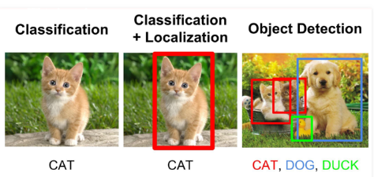
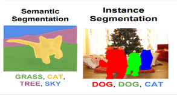
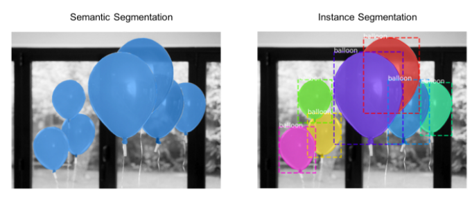

- Object Detection:
    
    Classify and detect the object(s) within an image with bounding box(es) bounded the object(s) (so we need to find class, position, size of each object)
    
    - Object Localization:
    
        locates the presence of an object in the image and represents it with a bounding box
        
    - Image Classification:
    
        Classify the object within an image (so we need to find class)
    
    _note: In object detection, the bounding boxes are always rectangular. So, it does not help with determining the shape of objects if the object contains the curvature part._
    
    
    
- Image Segmentation:
    
    Mark the presence of an object through pixel-wise masks generated for each object in the image. (we can find the exact shape of an object)
    
    - Semantic Semgentation:

        Label each pixel in the image (including background) with different colors based on their class

    - Instance Segmentation:
        
        Indentify the boundaries of the object and label their pixel with different colors
        
    
    

        