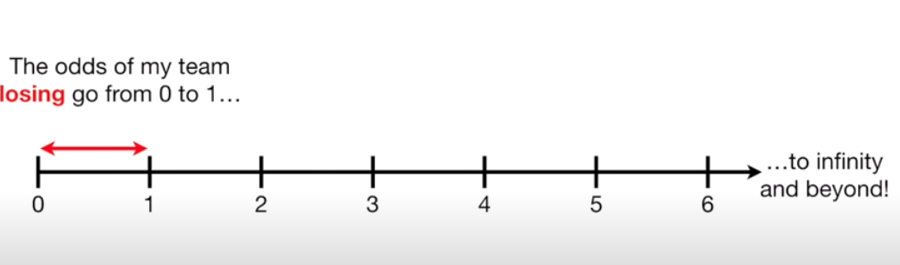

### Volumetric
Basically it's the representation of objects in 3D.
in oppose to 
### Multi View images 
which are multiple 2D representations
and 
### Depth map
which is an image or image channel that contains information relating to the distance of the surfaces of scene objects from a viewpoint.

### Affine transformation
a geometric transformation that preserves lines and parallelism (but not necessarily distances and angles)

### Saliency map
an image that shows each pixel's unique quality
Saliency can be seen as a segmentation problem...i.e. categorizing pixels...

### Octant (in solid geometry i.e. in geometry of 3-d euclidean space)
similar to quadrant for 2-dim and ray for 1-dim
where quadrant splits each of the two axes in half..so creates four boxes..
and ray splits a line into two..

### Octree
is a tree data structure in which each internal node has exactly eight children

so ... in places where our 3D object has boundaries and we want to show more details .. a node in one level of the octree is split and adds a new level in the octree :D
Each node in an octree subdivides the space it represents into eight octants.
A node stores an explicit three-dimensional point, which is the "center" of the subdivision for that node;
We use depth-first search and only required surfaces are viewed..

### Occupancy Grid
it is a discretized fine grain grid map (in 2D or 3D)

each square (or cube) of the grid must have a binary value regarding the objects occupying it .. i.e. it has trees or it doesnt..

it represents only static environment (e.g. a car in the scene that is moving wont be represented)

#### Probablistic occupancy grid
instead of cell storing binary it stores a probability corresponding to the probability that the square (or cube) is occupied

i.e. it's a belief map

we can update the probabilities periodically using the prior knowledge each time ..(bayesian update)

### LiDAR
LiDAR sensor uses pulses of light to mesure the distance of all points to our object of interest

### Odds
"the odds in favor of my team winning the game are 5 to 3"
i.e. 5/3
i.e. over 8 games in 5 my team will win

- Odds are not probabilities.
- Odds are the ratio of something happening (i.e. my team winning) to something not happening (i.e. my team not winning).
- Probability is the ratio of something happening (i.e. my team winning) to everything that could happen (i.e. my team winning and losing)

thus in above example probability of my team winning is 5/8

- You can calculate the odds:
    1. directly from the counts i.e. 5 wins / 3 losses or 
    2. directly from the probabilities i.e. probability of winning / probability of losing = 5/8 / 3/8 = 5/3

note: if my team is bad --> the odds of winning are below 1. 
if my team is good--> the odds of winning are above 1.

### Log Odds

The assymetry makes it difficult to compare the odds for or against my team winning.
**_--> Taking the log of the odds solves this problem 
by making everything symmetrical!_**

_**Using the log function, the distance from the origin (or 0) is the same for 1 to 6 and 6 to 1 odds.**_

log(odds) = log (5/3) or log (5/8 / 5/3)

i.e. log(p/1-p) which is called **_"logit function"**_ (and is the basis of logistic regression!!)

### Feature Map (in Convolutional Neural Networks)
it is the output of an input convolved with a filter

### Activation Volume (in Convolutional Neural Networks)
if e.g. input shape is 10 x 10 and filters used in convolution layer are 4 filters of 3x3 then activation volume is the resulting 8x8x4

_**Activation map**_ is each of the 8x8 results.
