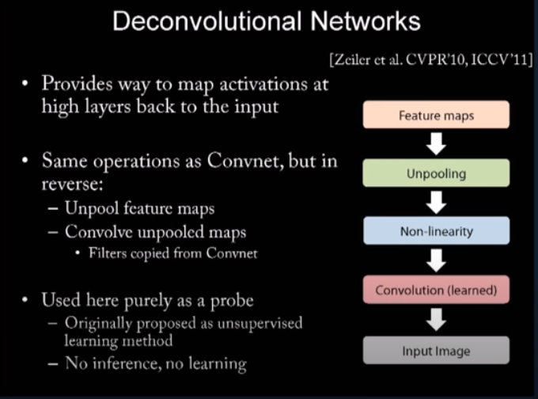
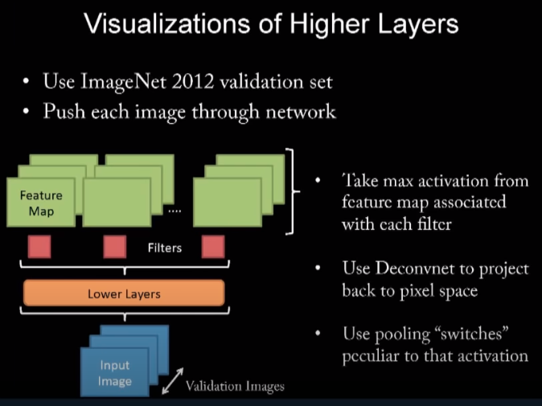
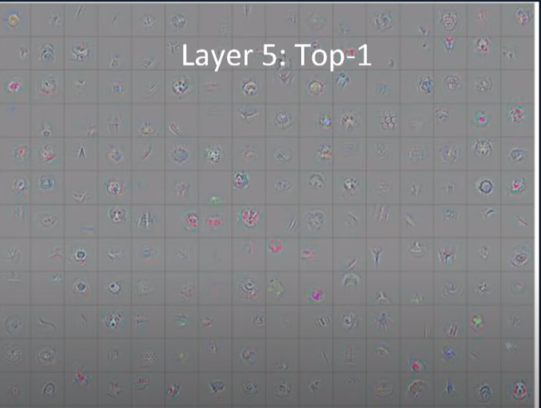
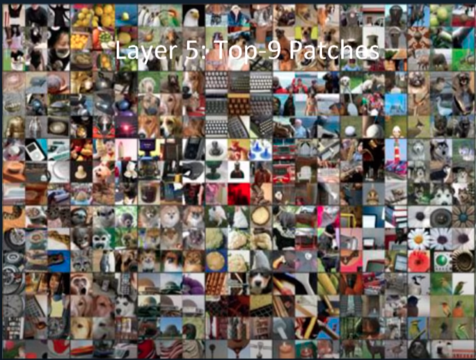

Visualizing and Understanding Convolutional Networks
---
(https://arxiv.org/pdf/1311.2901v3.pdf)

##### Goal
introduce a technique to visualize CNNs to understand better the intermediate feature layers and the operation of the classifier

##### How: Visualization Technique
By a multi-layered Deconvolutional Network that projects the feature activations back to the input pixel space!

##### Problem (also look at: https://www.youtube.com/watch?v=6wcs6szJWMY)
until now visualizing features was limited to:
- 1st layer visualization where projections to the pixel space are possible (because we can get the inner product of input image and a filter we can just visualize that filter as a small image ... the first layer almost always shows filters that focus on edges,corners,blobs. Note: when you take an inner product, the vector that maximimizes your inner product is a vector that looks like your other vector. So if a part of an image, A, maximizes the inner product of A and a filter, B, then we know how B looks like .. i.e. looks like that part of that image ..**so do we visualize the filter as it is or the part of the image that maximizes the inner product with the filter!?**)

- hard & inaccurate visualization in the other layers (e.g. how to visualize filters of shape 20x7x7x16 ? we can visualize 16 images of shape 20x7x7 but its not so interpretable. However visualizing feature maps is interpretable in some cases... still a feature map of shape 128x13x13 needs to be viewed as 128 greyscale images of size 13x13 .. still how do you know what part of the image it is?)

**_note also : by visualizing a filter we ignore the visualization of the bias and we also scale the filter's weights into 0-255_** 

_note also: One approach to visualize what's learned in the last layer (of classification network .. i.e. long encoded vectors) is to visualize the images of the nearest K neighbours within semantic space ... i.e. visualize images where last layer gives similar vector to your test image vector -- even if not trained with triplet loss the encodings can give you similar vectors for similar images._

##### How: Analysis of classifier
By occluding portions of the input image revealing which parts of the scene are important for classification.

##### How: network architecture
concolution layer + max pooling + local contrast operation that normalizes responses across feature maps + fully connected layer + softmax layer

##### How: network training
N labeled images {x,y}
cross entropy loss

##### Visualization with a **Deconvnet**
To start, an input image is presented to the convnet and features computed throughout the layers. To examine a given convnet activation, we set all other activations in the layer to zero and pass the feature maps as input to the attached deconvnet layer.
Then we successively (i) unpool, (ii) rectify and (iii) filter to reconstruct
the activity in the layer beneath that gave rise to the chosen activation. This is then repeated until input pixel space is reached

Unpooling: In the convnet, the max pooling operation is non-invertible, however we can obtain an approximate inverse by recording the locations of the maxima within each pooling region in a set of switch variables. In the deconvnet, the unpooling operation uses these switches to place the reconstructions from the layer above into appropriate locations, preserving the structure of the stimulus.

The convnet uses learned filters to convolve the feature maps from the previous layer. To invert this, the deconvnet uses transposed versions of the same filters, but applied to the rectified maps, not the output of the layer beneath i.e. we flip the filter vertically and horizontally.

##### Results
outperform models on ImageNet classification benchmark (and on Caltech101 and Caltech256)

### Notes / Interesting
1. fig4: the visualization shows the strongest activation (across all training examples) for a given feature map. Also each feature map is shown in different epochs (look at the face one!!!!).

2. notice how visualization is done in fi7. we have the feature map and then its projection onto the input image (only then we understant what the feature map focuses on)

3. notice in fi7 the difference between features of hidden encoding (convolutional) layers and output classification layer .. e.g. strongest feature in layer 5 is the letters but the classifier is most sensitive to the wheel!

4. One shortcoming of the deconvnet is that it only visualizes a single activation, not the joint activity present in the layer

5. certain layers need different time to converge

6. by visualizing the layers' activations they found out that smaller conv filters are worse ..

### From Video presentations

"To visualize, we select a single feature map to look at..and we take the strongest activation in that map and that input image.
 This is used as input to the Deconv Layer (which uses the same switches for pool/unpool and same filters for conv/deconv) to construct the output in the pixel space. In fact we want to take max activation over all input images. And in fact we want to visualize all feature maps in all layers. So we take max activation for each feature map over all images."

 
 
 

 

"from unpooling we implicitly get some local rotation invariance"

"even though there is no class `text` the model learned to associate text with the car class"

 
### My Questions
1. in fig2, they project the activations of one layer into pixel space using deconv approach.. do they mean that the deconv filters of size MxM into initial pixel size NxN or they show pixels fo layer size i.e. MxM ? if it's the first ... are all papers showing activations using deconv? (also in fig7 how is the projection done?!)

2. what is the conclusion from fig5? that the network is transformation invariant in some inputs (some classes) and in few (e.g. entertainment center) is not?

3. ~~in fig7 what is the purpose of the grey square in the input ? to add noise in training data? or to see that is the activations and labels at the grey i.e. if it understands missing part?!~~ it is to see the activations and class probabilities when the grey pixel moves around the parts of the input image!

4. what is "contrast operation that normalizes responses across feature maps"?

5. when they say "for each feature map take max activation over all inputs" what does it mean ? taking max values over each point of the feature map ? i.e. if 
   input 1 in layer is 
   [[1,1,1],[2,2,2]] and one filter gives activation map 
   [[1,2],[2,3]] and another activation map gives 
   [[3,3],[2,2]] and for another input we get for first map
   [[1,4],[2,2]] and for second filter we get feature map 
   [[2,2],[3,3]] then result is for map 1 of the layer take [[1,4],[2,3]] and for map 2 of layer take [[3,3],[3,3]] !?
