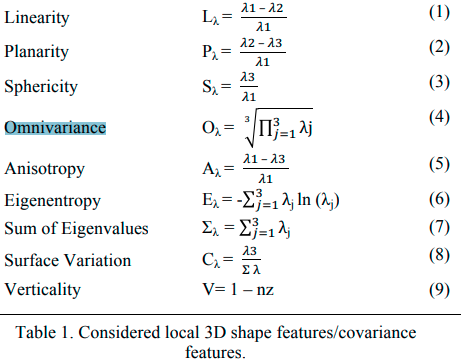

GEOMETRIC_FEATURES_ANALYSIS_FOR_THE_CLASSIFICATION
---
Our work aims at identifying a subset of features that performs well with different 3D heritage datasets. We extract various geometric features (Section 2.1) at different scales (Section 3.2) and run a multi-scale classification with a Random Forest classifier (Section 2.2).

### Feature extraction – covariance features

- Calculate the covariance matrix computed within a local neighbourhood of a 3D point. We can get shape descriptors by combining some of the eigenvalues. Features values highlight the main linear (1D), planar (2D) or volumetric (3D) structure of the point cloud in the neighbourhood.
- We also include a feature for the verticality and a feature for the height of the points.
- 
- in some models (buildings) they used color RGB features as well

### Evaluation on:
- Four different monument buildings with recurrent architectural elements such as columns, architrave (molded frame around a doorway), frieze(painted decoration on a wall near the ceiling). Data captured with either lazer scanner or photogrammetric techniques.

### Notes: 
- The task of classification here is Part Segmentation.
- For each building they train one model. They select some of its points as training data and test the model on the rest of the points. Note that the buildings contain repetitive structures. I guess because of each building being trained separately and containing repetitive structures that’s why verticality and radius matter...

### Results:
- the Verticality V is highly relevant, even when considering different neighbourhood radii
- among the covariance features the most relevant are Surface Variation Cλ, Planarity Pλ, and Sphericity Sλ

### Conclusion:
The paper provided a general and straightforward method to classify heritage point clouds composed of repetitive architectural elements. The choice of the optimal neighbourhood radius for covariance features extraction is based on the knowledge of a few essential measures. Radii values are derived from simple proportional and dimensional rules, typically used for the construction of classical architectures and in the different heritage building of the following centuries. Achieved results indicate that to obtain correct classifications, it’s not necessary to use a lot of features extracted at many different scales. Indeed, the adaptive size strategy allows the retrieval of better results in a shorter time. The inclusion of the height information (Z coordinates) of the points as extra feature proved to deliver a general improvement of the accuracy for the considered case studies (Table 7). Further tests are planned to verify the replicability of the developed methodology with more complex and not repetitive structures, as well as to identify and test more geometric rules for the classification of buildings with different architectural styles.
