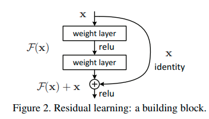

[Deep Residual Learning for Image Recognition](https://arxiv.org/pdf/1512.03385.pdf)

We provide comprehensive empirical evidence showing that these residual networks are easier to optimize, and can gain accuracy from considerably increased depth.

 On the ImageNet dataset we evaluate residual nets with a depth of up to 152 layers—8× deeper than VGG nets but still having lower complexity.

we also won the 1st places on the tasks of ImageNet detection, ImageNet localization, COCO detection, and COCO segmentation.

The formulation of F(x) +x can be realized by feedforward neural networks with “shortcut connections”

y = F(x, {Wi}) + Wsx. 

