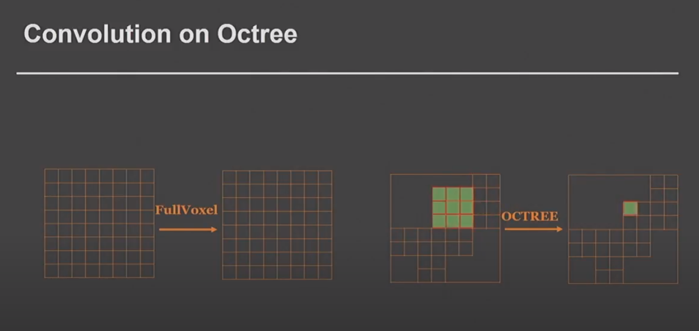

O-CNN: Octree-based Convolutional Neural Networks for 3D Shape
Analysis
---
(https://wang-ps.github.io/O-CNN_files/CNN3D.pdf)

### From Abstract, Conclusion and Images

##### Method

input:
the average normal vectors of a 3D model sampled in the finest leaf octants

performs:
3D CNN operations on the octants

A novel octree data structure to efficiently store the octant information and CNN features into the graphics memory and execute the entire O-CNN training and evaluation on the GPU.

Supports various CNN structures

Works for 3D shapes in different representations

##### Idea
perform 3D CNN operations only on the sparse octants occupied by the boundaary surfaces of 3D shapes!! 

so do convolution on sample points of leaf octrees (fine representation), pool and return result to higher nodes, do convolution on higher nodes etc... 

##### Technical challenge
parallelization of O-CNN computations defined on the sparse octants..

##### How
they design novel octree structure that stores octant info on GPU 
**_they pack the data of sparse octants at each depth as continuous arrays_**
**_a label buffer is introduced to find the correspondence between the features at different levels ..._** 

##### How - convolution 
to efficiently do 3D convolutions with any kernel size:
    - build _**hash table to quickly get the local neighborhood**_ volume of eight sibling octants
    - compute 3D _**convolutions of these eight octants in parallel**_!

##### Results
- much more efficient+successful than full-voxel approaches
- experiments run on object classification, shape retrieval and shape segmentation

classification is already performing well on resoltion 2^3 ..which means the network can recognize 3D shape easily from far away like a human..

##### Octree Construction
1. uniformly scale the 3D shape into an axis-aligned unit 3D bounding cube
2. then recursively subdivide the bounding cube of the 3D shape in breadth-first order
    - traverse all non-empty octants occupied by the 3D shape boundary at the current depth l and subdivide each of them to eight child octants at the next depth l + 1.
    - repeat until the pre-defined octree depth d is reached.
3. now collect info useful for CNN computations. 
    - compute a shuffle key and a label for each octant
    
    Shuffle Key of an octant O at depth l: 
    encodes its position in 3D space with a unique 3 l-bit string i.e. x1y1z1x2y2z2...xlylzl, where each xi,yi,zi ε {0,1} defines its relative position in the 3D cube of its parent octant. The integer coordinates (x,y,z) of an octant O are determined by x=(x1x2...xl), y=(y1y2...yl), z=(z1z2...zl). The shuffle key vector Sl of 3xl size can be used to construct the neighborhood of an octant for 3D convolution. In their implementation each shuffle key is stored in a 32 bit integer.
    We keep a list of the sorted keys..
    
    Label  
    We assign a label p for a non-empty octant at the l-th depth, indicating it's the pth non empty octant in the sorted octant list of the l-th depth.
    
    because we sort the non empty octants ...  
    Given a non-empty node with index j at the l-th depth, we compute the index k of its first child octant at the (l + 1)-th depth by k = 8 × (Ll[j] − 1)
    
    Input Signal  
    input of CNN = the averaged normal vectors computed at the finest leaf octants. If the leaf octant is empty we use a zero vector. _**If the octant is non empty, we sample the 3D shape surface embedded in the leaf octant with a set of points and average the normals of all samples points as the input vector.**_ The size of the vector is the number of the finest leaf octants in the octree.
    
    CNN features  
    for each 3D convolution kernel defined at the lth depth, we record the convolution results on all the octants at the lth depth in a feature map vector Tl.
    
    Mini-batch of 3D models  
    Note that if we have a batch of e.g. 4 3D objects to be used in a training step, these 4 objects will generate different octrees .. thus we need to do something for the efficient convolution of all at once. We merge these 4 octrees into one super-octree (concatenate vectors at each depth and do some re-calculations of keys etc)
    
##### CNN operations on the octree
 for convolution basically we have: our feature vector that can be of shape widthxheightxchannels and our kernel that has a size in width, height and channel and we can have N kernels ... 
 
 here, in OCNN, we have our octant feature (of n channels) and the convolution weights (filter) .. and we just do a matrix product 

_**the convolution with kernel size K requires the access of K^3-1 neighboring octants of an octant (neighbor in any dir)**_
keeping hash tables to access neighbors etc makes it possible and efficient ..
searching only once for 8 octant children when stride is 1 or 2 makes it more efficient..

for pooling, usually we do max pooling of kernel size 2 and stride 2 .. here because 8 children are stored consecutively we just pick max element out of 8 consecutive elements ..

unpooling is up-sampling. usually we use max-unpooling.

data storage and CNN computations are only applied in non empty octants.

##### Architecture

operation sequence applied at l-th depth octants:
Ul defined as “convolution + BatchNormalization + ReLU + pooling”

number of channels of the feature map for Ul is set to 2^max(1, 9-l)
_**convolution kernel size is 3**_

input ---> Ud ---> U(d-1) ----> ... ---> U2 
(i guess we stop at U2 because we can't convolve with kernel size 3 in depth level 0 or 1 where we have one or two octants in each dir accordingly)

1. For object classification:
    - add two FC layers, a softmax layer, two dropout layers i.e. OCNN + Dorpout + FC + Dropout+ FC + Softmax
2. For shape retrieval:
    - _**use the output of object classification as the key to search for the most similar shapes to the query_** (i guess utilizing siamese network ?)
3. For shape part segmentation:
    - use deconvolution network after convolution network ==> OCNN ... + ...mirror of OCNN i.e. OCNN(d) ---> DU2 --> DU3 ---> DUd

##### Experiments on:
i7 3.2ghz, geforce 1080, 8gb memory

##### Experiments use:
SGD
momentum 0.9
weight decay 0.0005
batch size 32
dropout ratio 0.5
initial lr 0.1, decreased by factor of 10 after every 10 epochs
optimization stops after 40 epochs

##### Training data for classification
augment data: 12 poses for each model

##### Experiments on classification
loss function = cross entropy

1. on resolution: 
    OCNN(3), ...OCNN(8) i.e. resolution 8^3...resolution 256^3

2. on input representation:
    full voxel with binary signal (not OCNN but VoxNet)
    full voxel with normal signal with zero vectors in empty voxels (not OCNN but VoxNet)
    octree with normal signal (OCNN)
    octree with binary signal (OCNN)

##### Experiments on retrieval
since we have 12 poses for each object, when we use the classification network we get one output vector for each of these 12 poses.
then we can use pooling to get one output feature vector.
For retrieval, we get the feature vector for all the shapes, and then we use vector distance to retrieve the most similar shapes.

##### Experiments on part segmentation

They used CRF refinement

##### performance measures 
- computation:
    - average time per iteration
    - peak GPU memory consumption
- retrieval:
    - precision
    - recall
    - mAP
    - F-score
    - NDCG

### Notes:
- they didnt use different levels of octrees...i.e. dense and sparse areas had same octree level

- from fig1: initial convolution (first layer) is applied on the deepest depth of the octree .. while later convolutions are applied to more shallow depths of the octree! (look also at fig2d!)

- basically .. if we add one level of depth in the octree we just add one array and one 3D convolution !

- from fig5 we see that max pooling is just max number of the 8 numbers in an octant i.e. 8 contiguous numbers in the array!

- a problem with the image-based approaches is that it is unclear how to determine the number of views to cover the 3D shape while avoiding self-occlusions.

- in this work the octree structure is optimized for CNN, thus 
    - they discard the pointers from parent octants to children octants (as in traditional octree) and introduce a label array for finding correspondence of octants at different depths for downsampling.
    - instead of computing the neighborhood of a single octant, they construct the neighborhoods for eight children nodes of a parent node for fast CNN computations

- note that octree is just the representation of data... so still to do convolution they will get the needed voxels (octants) to represent the needed 3D space for the convolution and use a 3D filter and do proper 3Dconvolution!

                      
### My Questions

1. so..from fig2..if within a space there are many empty voxels then we have in some deep layers really sparse and big vectors.. correct ? so is using sparse matrices (tensorflow/numpy etc) really useful or is this anyway an issue?

2. as i understand from the "how" section .. _**we have efficient convolution as each level can be convoluted at once and efficient pooling as there is directly pointing to correspondence in other levels!? :)**_

3. ~~_**in fig4...is it an example for when the 2D convolution kernel is less or equal to 3 !? i.e. if kernel was 5x5 we take more octants but still union them!?**_ (he also mentions in related work that instead of calculating neighborhood of one octant we calculate for 8 octants .. so always eight ? is it 8 because of the 8 children ? how are convolutions then if kernel size is bigger than that ?)~~ I think yes, that's why they always keep convolution kernel size 3.

4. ~~assigning T and L in fig5 ..?~~

5. ~~in table1 where we see 32^3 resolution of voxels, does it mean 2^5=32..so 5 depth octree needed, so 5 O-CNN layers?!~~ Probably yes because they use depth 5 in implementation.

6. i guess the xi,yi,zi that is represented by 0 or 1 is like 'left' or 'right' in that direction !?

8. _**"The size of the vector is the number of the finest leaf octants in the octree." what does this means ? i thought they store average normal vector on each octant thus if finest octant leafs are 6 in total then we have concatenation of 6 vectors of size 3 (i.e. nx,ny,nz) or is the average normal represented by an integer number like the {0,1} positions explained for keys?**_

9. **_(fig.5) shouldnt the unpooling put everywhere the max value and not add zeros ?_**

10. _**what is deconvolution in regular CNN?**_

11. what is the concept of LeNet ?

12. How is OCNN(d) ---> Ud2 ?
