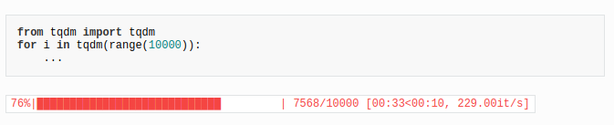

Keras
---

- ImageDataGenerator.flow_from_directory


tqdm
---

```
from tqdm import tqdm
for i in tqdm(range(start_iter, max_iter + 1), ncols=80): ...
```




Tensorflow
---

- tf.train.piecewise_constant(x, boundaries, values, name=None)
    
    e.g. to use a learning rate that's 1.0 for the first N steps, 0.5 for the next N steps, and 0.1 for any additional steps.
    
- tf.variable_scope(scope_name, reuse)
    
    Reuse set to:
    
    - None: means this tf.variable_scope() inherits parent variable scope reuse mode
    - True: makes this variable scope and sub scopes to a reuse mode if sub scopes have set reuse = None.
    - tf.AUTO_REUSE: it will create variables if they do not exist, and return them otherwise.
    
    When we use tf.variable_scope(), we should use tf.get_variable() function to create or return an existing variable. If you use tf.Variable(), it will create a new variable no matter what value the reuse parameter is.
    
    tf.get_variable() can create a new tensorflow only if reuse = None or tf.AUTO_REUSE. if reuse = True, tf.get_variable() can only return an existing variable created by tf.get_variable(); it can not create a new one.
    
    ```python    
    # we can have two python variables that point to the same tensroflow variable:
    def layer_weight():
        with tf.variable_scope("weight", reuse = tf.AUTO_REUSE):
            w = tf.get_variable(name = 'w',initializer = tf.random_normal(shape=[2,2], mean=0, stddev=1))
        return w
    w1 = layer_weight()
    w2 = layer_weight()
    # w1 is same as w2
    ```

- tf.layers.batch_normalization(conv, axis=1, training=training)

    Can be used instead of manually generating moving averages and update ops ...
    
- run() vs eval():

    - op.run() is a shortcut for calling tf.get_default_session().run(op)
    - t.eval() is a shortcut for calling tf.get_default_session().run(t)
    - The difference is in [Operations](#Operation) vs. [Tensors](#Tensor). Operations use run() and Tensors use eval().

#### Tensorflow definitions

##### [Tensor](https://www.tensorflow.org/api_docs/python/tf/Tensor)
Represents a rectangular array of data.

A tensor has a signle data type and a shape.

A tensor's shape may not always be fully known. (In tf.function definitions, the shape may only be partially known.)

Examples of specialized tensors: ```tf.Variable, tf.constant, tf.placeholder, tf.sparse.SparseTensor, and tf.RaggedTensor```

You can call ```.consumers()``` on a tensor to see a list of operations that consume this tensor and ```eval()``` to evaluate a tensor **in a session.**

##### Operation
Represents a graph node that performs computation on tensors.

##### [Variable](https://www.tensorflow.org/api_docs/python/tf/Variable)
Variable is basically a wrapper on Tensor that maintains state across multiple calls to run, and I think makes some things easier with saving and restoring graphs. A Variable needs to be initialized before you can run it. You provide an initial value when you define the Variable, but you have to call its initializer function in order to actually assign this value in your session and then use the Variable.

You can specify a Variable as trainable (the default, actually), meaning that your optimizer will adjust it in an effort to minimize your cost function; you can specify where the Variable resides on a distributed system; you can easily save and restore Variables and graphs.

#### (Unit)Testing Tensorflow:

```python 
class Octree2ColTest(tf.test.TestCase):
    ...
    def test_forward(self):
        with self.cached_session():     
            ...
```

- tf.test.compute_gradient(..) to compute theoretical and numerical jacobian gradients!

- self.assertAllClose() to assert that each number of arrays differs from its equivalent no more than a small number!


#### [Feeding data into the model](https://github.com/tensorflow/tensorflow/issues/19933):

> Use an input pipeline to ensure that the GPU doesnt have to wait for new stuff to come in (like when using "feed_dict")
```python
iter = dataset.make_initializable_iterator()
features, labels = iter.get_next()
net = tf.layers.dense(features, 8, activation=tf.tanh)
```

Using input pipeline (here the inputs are not placeholders; they are directly tensors with data):
```python
dataset = tf.data.TFRecordDataset(data_file)
dataset = dataset.prefetch(buffer_size=batch_size*10)
dataset = dataset.map(parse_tfrecord, num_parallel_calls=5)
dataset = dataset.repeat(num_epochs)
dataset = dataset.batch(batch_size)

features, labels = dataset.make_one_shot_iterator().get_next()    
logits = tf.feature_column.linear_model(features=features, feature_columns=columns, cols_to_vars=cols_to_vars)
train_op = ...

with tf.Session() as sess:
    sess.run(train_op)
```

Using feed_dict (here the inputs are placeholders):
```python
example = tf.placeholder(dtype=tf.string, shape=[None])
features = tf.parse_example(example, features=tf.feature_column.make_parse_example_spec(columns+[tf.feature_column.numeric_column('label', dtype=tf.float32, default_value=0)]))
labels = features.pop('label')
train_op = ...

dataset = tf.data.TFRecordDataset(data_file).repeat().batch(batch_size)
next_batch = dataset.make_one_shot_iterator().get_next()

with tf.Session() as sess:
    data_batch = sess.run(next_batch)
    sess.run(train_op, feed_dict={example: data_batch})
```

#### On the input data pipeline:

- Most dataset input pipelines should end with a call to prefetch. This allows later elements to be prepared while the current element is being processed. This often improves latency and throughput, at the cost of using additional memory to store prefetched elements.
    ```python
    tf.DataSet()...prefetch()    
    ``` 

- 
    ```python
    tf.data.TFRecordDataset('path').take(-1)
    # with -1 we take all samples of dataset
    ```

yacs
---

Use this library for configuration!:
```python
from yacs.config import CfgNode as CN
FLAGS = CN()
...
def _update_config(FLAGS, args):
  FLAGS.defrost()
  if args.config:
    FLAGS.merge_from_file(args.config)
  if args.opts:
    FLAGS.merge_from_list(args.opts)
  FLAGS.SYS.cmds = ' '.join(sys.argv)
  FLAGS.freeze()
```

shutil
---
```python
import shutil
shutil.copy2(args.config, logdir)
```

Python built-in functions
---

- eval()
    ```python
    eval('self.{}()'.format(self.flags.run))
    ```

- __init__() vs __cal__()

    ```python
    class Foo:
        def __init__(self, a, b, c):
            pass
        def __call__(self, a, b, c):
            pass
    
    x = Foo(1, 2, 3) # calls __init__
    x(4, 5, 6) # calls __call__
    ```

