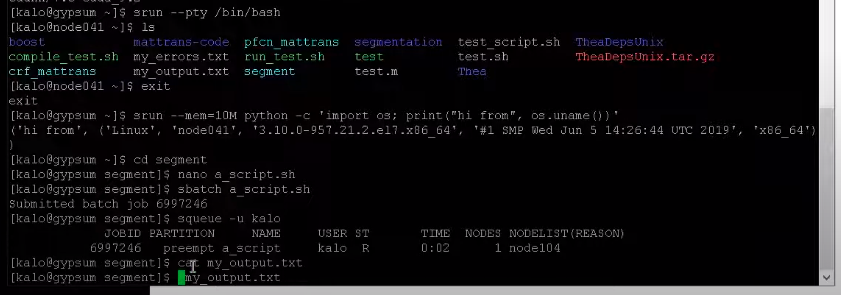

ssh gypsum.cs.umass.edu // within umass.edu or using vpn
ssh gypsum-gateway.cs.umass.edu // accessible outside cs, but you need ssh keys
ssh swarm2.cs.umass.edu // accessible outside cs

--> connects on head node (don't run jobs here. use slurm to schedule and launch jobs on slaves)


Examples:

- Find available modules in the cluster: ```module avail```
- Initiate sudo terminal (i.e. run an interactive job where you can do ls etc): ```srun --pty /bin/bash```
  (instead of kalo@gypsum now it is kalo@node41) and exit the node using ```exit```
- Run an interactive job and return to head: ```srun --mem=10M python -c 'import os; print("hi from", os.uname())'```
- run non interactive job: ```sbatch -o my_output.txt --gres=gpu:2 my_experiment.sh```
- run non interactive job: ```sbatch my_experiment.sh``` where my_experiment.sh contains
       ```
       #!/bin/sh
       #SBATCH -o my_output.txt
       #SBATCH -e my_errors.txt
       #SBATCH --time=12:00:00
       #SBATCH --partition=1080ti-long
       #SBATCH --gres=gpu:1
       #SBATCH --mem=20GB
       #SBATCH --cpus-per-task=2
       ./mynet/train.bin // here i specify the python script or other executable to run
       ```
       by specifying -o and -e we can access the output and error files while running ... 
- check if you are running jobs by ```squeue -u kalo```
- find idle nodes: ```sinfo --state=idle```
- use this script to see all nodes stats: ```/mnt/nfs/work1/miyyer/scripts/slurm/gpu_counts.sh```
- use this script to see who is over using the nodes: ```/mnt/nfs/work1/miyyer/scripts/slurm/over_usage.sh```
- get info about currently running jobs: ```scontrol show jobid | grep -B 1 -A 24 UserId=kalo```
- get info about jobs started by you: 
    ```
    sacct --allusers --gid kalo
    --starttime 2020-09-24
    --format=User,JobID,Jobname,partition,state,time,start,
    end,elapsed,MaxRss,MaxVMSize,nnodes,ncpus,nodelist
    ```
- cancel a job by its id: ```scancel 6992927```
- cancel all my jobs: ```scancel ‐u kalo```





Important: Environment per user:
---
The Gypsum cluster uses Environment Modules: maintain multiple versions of
compilers, libraries and applications for different users on the cluster.

Use the following commands to adjust your environment:
- module avail // show available modules
- module list // show modules currently loaded
- module add <module> // adds a module to your env. for current session
- module initadd <module> // configure module to be loaded at every login
MUST READ: https://gypsum-docs.cs.umass.edu/user.html

e.g.
After logging into the node, load the desired version of MATLAB with the ```module load``` command. You can see what versions are available with ```module avail matlab```

note:
DO NOT PERFORM TOO FREQUENT I/O (SLOW!). PREFETCH DATA IN BIG CHUNKS.


