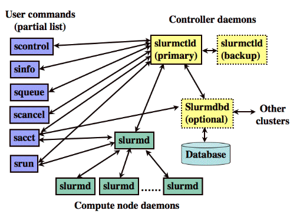
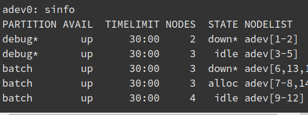
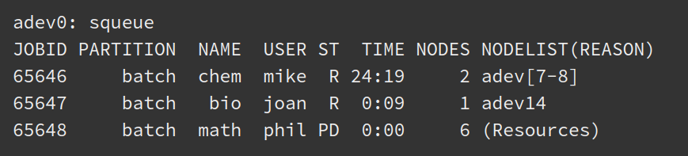
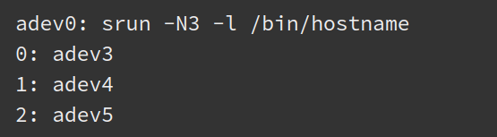

https://slurm.schedmd.com/quickstart.html



entities of slurm daemons:
    - nodes (compute resource in Slurm)
    - partitions (groups nodes into logical sets. Can be considered as job queue that has a job size limit, job time limit, users permitted to use it etc)
    - jobs (allocations of resources assigned to a user for a specified amount of time)
    - job steps (sets of possibly parallel tasks within within a job)


Useful to get the status of cluster:

- sinfo
  
  debug with * shows that debug is the default partition for submitted jobs
  down with * shows that the nodes are not responding

- squeue
  
  ST = R means running, ST = PD means pending
  Nodelist(Reason) of pending can be Resources or Priority
 
- scontrol 
    - scontrol show partition
    - scontrol show node adev1
    - scontrol show job

- srun
    - srun -N3 -l /bin/hostname will execute /bin/hostname on three nodes (-N3) and include task numbers on the output (-l). Default partition will be used. One task per node will be used by default.
    

- sbatch (to submit a script for later execution)
    - sbatch -n4 -w "adev[9-10]" -o my.stdout my.script
    Will run the script my.script
    Explicitly use nodes adev9 and adev10
    Explicitly state that job steps will spawn four tasks each so that it ensures that the allocation will have at least 4 processors
    Output will appear in file mt.stdout
    
    The script:
    ```
    #!/bin/sh
    # all sbatch options can be specified here. Any option given on the command line will override the options specified here.
    #SBATCH --time=1
    /bin/hostname
    srun -l /bin/hostname
    srun -l /bin/pwd
      ```
    There is expplicit time limit for the job
    the command /bin/hostname will be executed on the first node in the allocation (where the script runs).
    Then the other two job steps initiated with srun will be executed sequentially

  
SOS
---

interactive jobs ==> "srun"
non interactive ==> "sbatch"

~~~~